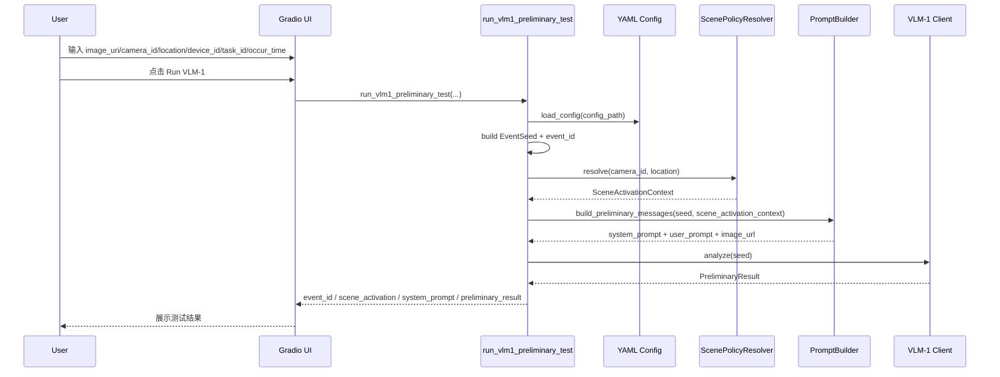
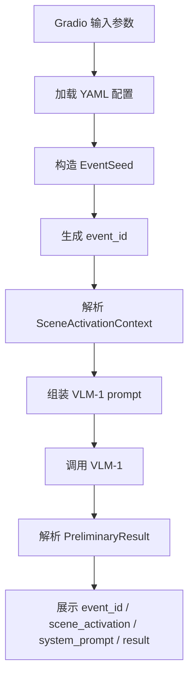

# Gradio VLM-1 测试应用设计

## 1. 目标

本文档定义一个**独立于当前 MVP 主链路**的 Gradio 测试应用，用于直接测试 `VLM-1` 的输入、场景策略解析、提示词组装和结构化初判输出。

这个工具的定位是：

- 调试 `camera_id + location -> scene policy -> VLM-1` 这一段链路
- 观察 `VLM-1` 最终看到的 `system prompt`
- 直接查看 `PreliminaryResult`

它**不参与**当前 FastAPI 主入口，也**不进入** `SAM3 -> VLM-2` 链路，因此不会破坏当前 MVP 收敛代码。

## 2. 设计边界

### 2.1 纳入范围

- 加载现有 YAML 配置
- 构造 `EventSeed`
- 解析 `camera_id + location` 对应的场景策略
- 生成最终 `VLM-1` prompt
- 直接调用 `VLM-1`
- 在页面上显示：
  - `event_id`
  - `scene_activation_context`
  - `system_prompt`
  - `PreliminaryResult`

### 2.2 明确不做

- 不复用 `/v1/inspection-items` API 路由
- 不调用 `SAM3`
- 不调用 `VLM-2`
- 不写入 `event_store`
- 不发送 callback

## 3. 组件设计

独立测试应用由两层组成。

### 3.1 Core tester service

文件：

- `src/ares_agent/tools/vlm1_tester.py`

核心函数：

- `run_vlm1_preliminary_test(...)`

职责：

1. 加载配置
2. 构造 `EventSeed`
3. 调用现有 scene policy / prompt builder
4. 只调用 `VLM-1`
5. 返回结构化测试结果对象

### 3.2 Gradio UI

同样在：

- `src/ares_agent/tools/vlm1_tester.py`

入口函数：

- `create_gradio_app(...)`

职责：

1. 渲染输入表单
2. 调用 core tester service
3. 显示调试结果

## 4. 输入与输出

### 4.1 输入

页面输入沿用当前 MVP 的最小输入契约：

- `image_uri`
- `camera_id`
- `location`
- `device_id`
- `task_id`
- `occur_time`

### 4.2 输出

页面输出建议固定为 4 块：

1. `event_id`
2. `scene_activation_context`
3. `system_prompt`
4. `preliminary_result`

这 4 块足够覆盖：

- 输入主键是否正确
- 场景策略是否正确
- prompt 是否正确
- 模型输出是否正确

## 5. 调用流程说明

### 5.1 处理步骤

Gradio 页面点击 `Run VLM-1` 后，按以下顺序处理：

1. Gradio 收集输入参数
2. Core tester 加载配置文件
3. 构造 `EventSeed`
4. 计算 `event_id`
5. 解析 `camera_id + location` 对应的 `SceneActivationContext`
6. 生成最终 `VLM-1 messages`
7. 直接调用 `VLM-1`
8. 返回页面可展示的结构化结果

### 5.2 时序图



### 5.3 流程图



## 6. 运行方式

推荐运行命令：

```bash
uv run python -m ares_agent.tools.vlm1_tester --config config/agent_config.example.yaml --host 127.0.0.1 --port 7860
```

说明：

- `--config` 用于指定测试使用的配置文件
- 不影响现有 FastAPI 主服务
- 适合：
  - 本地 mock 模式
  - 本地 HTTP stub 模式
  - 真实 `mode=http` 联调模式

## 7. 与当前 MVP 主链路的关系

这个工具与当前 MVP 主链路是并行关系，而不是嵌入关系。

主链路仍然是：

- `FastAPI -> VLM-1 -> SAM3 -> VLM-2 -> callback -> event_store`

Gradio tester 是：

- `Gradio -> VLM-1`

也就是说，它的作用是：

- 为 `VLM-1` 提供单独的可视化调试入口
- 不破坏 MVP 当前的最小收敛边界

## 8. 测试策略

该工具的最小测试重点是 core service，而不是 Gradio 本身。

当前应至少覆盖：

1. mock 模式下的 `run_vlm1_preliminary_test`
2. http 模式下的 `run_vlm1_preliminary_test`
3. prompt 预览是否正确返回
4. `scene_activation_context` 是否正确返回

这样可以把 UI 变化和核心测试链路分开，保持工具可维护。
