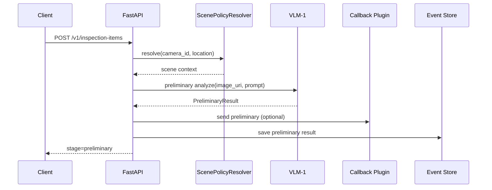
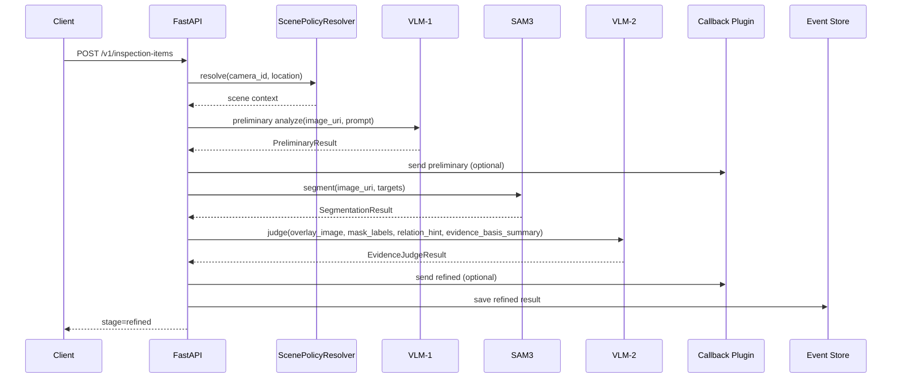

# 正式服务启动与链路模式说明

## 1. 目标

本文档说明当前服务的正式启动方式，以及如何通过配置切换：

- `vlm1_only`
- `full`

同时明确 MinIO 图像 URL 的要求。

## 2. 启动脚本

当前正式启动入口为：

- [run_service.sh](/mnt/lc/LC/ares_xtws/ares_agent/scripts/run_service.sh)
- [run_service.py](/mnt/lc/LC/ares_xtws/ares_agent/src/ares_agent/tools/run_service.py)

推荐命令：

```bash
./scripts/run_service.sh --config config/agent_config.example.yaml --host 0.0.0.0 --port 8000
```

该脚本只是正式服务包装层，底层仍然调用：

- `create_app(config_path=...)`

因此不会引入第二套运行逻辑。

## 3. 链路模式

在配置文件中通过：

```yaml
orchestrator:
  chain_mode: full
```

或：

```yaml
orchestrator:
  chain_mode: vlm1_only
```

控制服务运行模式。

### 3.1 `full`

完整链路：

- `VLM-1 -> SAM3 -> VLM-2 -> callback -> event_store`

适用于正式巡检闭环。

### 3.2 `vlm1_only`

只运行第一阶段：

- `VLM-1`

特点：

- 不进入 `SAM3`
- 不进入 `VLM-2`
- 不发送 refined callback
- HTTP 返回 `stage=preliminary`
- `preliminary_feedback.async_enqueued=false`

配置约束：

```yaml
callback:
  send_preliminary: true
  send_refined: false
```

否则配置加载阶段会直接失败。

## 4. MinIO 图像 URL 约束

当前正式服务针对 MinIO 的要求是：

- `image_uri` 使用 `http(s)://minio-host/bucket/object`

在服务模式下：

- 该 URL 会原样传递给 `VLM-1`
- 如果是 `full` 模式，也会原样传递给 `SAM3`

因此当前不需要在服务端做额外 MinIO SDK 下载或 presign 转换。

## 5. 行为总结

### `vlm1_only`

输入：

- `image_uri`
- `camera_id`
- `location`
- `device_id`
- `task_id`
- `occur_time`

输出：

- `event_id`
- `stage=preliminary`
- `preliminary`
- `preliminary_feedback`

### `full`

输入同上。

输出：

- `event_id`
- `stage=refined`
- `preliminary_feedback`
- `refined_feedback`
- `judgment`
- `evidence_package`

## 6. 时序图

### 6.1 `vlm1_only`



### 6.2 `full`


